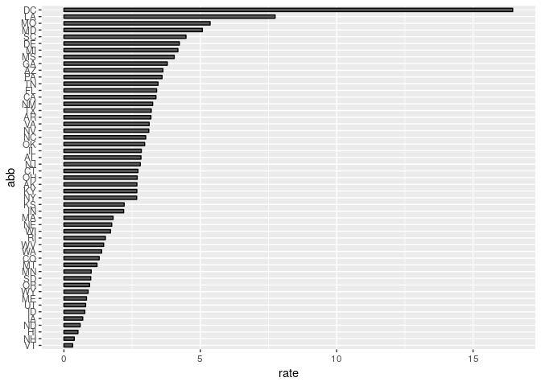

report murders
================
Yo
March 31, 2019

R Markdown
----------

This is an R Markdown document. Markdown is a simple formatting syntax for authoring HTML, PDF, and MS Word documents. For more details on using R Markdown see <http://rmarkdown.rstudio.com>.

When you click the **Knit** button a document will be generated that includes both content as well as the output of any embedded R code chunks within the document. You can embed an R code chunk like this:

``` r
library(tidyverse)
```

Including Plots
---------------

You can also embed plots, for example:

``` r
load("rda/murders.rda")
```

Note that the `echo = FALSE` parameter was added to the code chunk to prevent printing of the R code that generated the plot.

Murder rate by state
--------------------

We note the large state to state variability by generating a barplot showing the murder rate by state:


